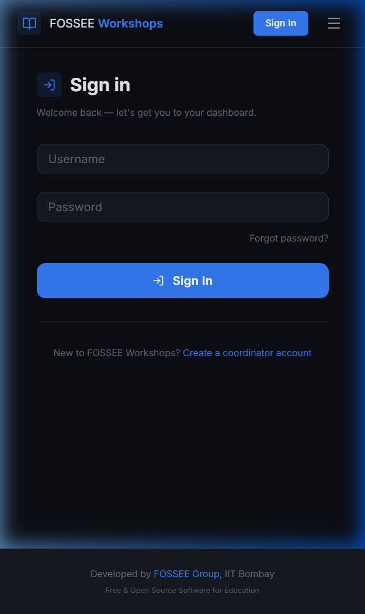
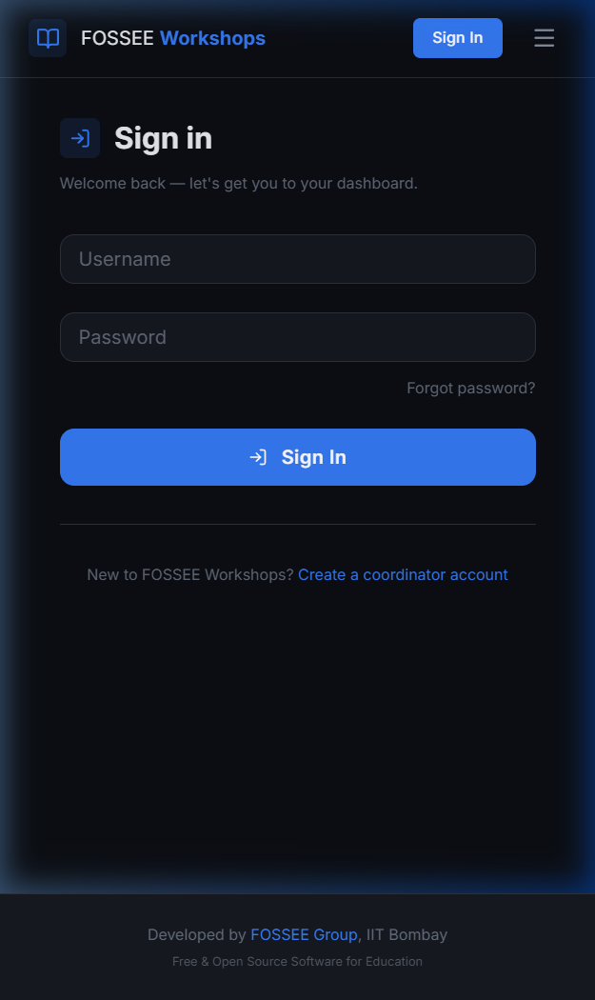
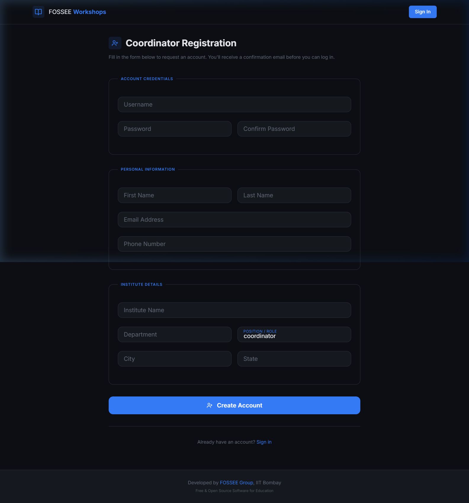

# FOSSEE Workshop Booking — React UI/UX Redesign

A complete frontend rebuild of the FOSSEE Workshop Booking platform using **React + Vite**, replacing a minimal Bootstrap 4 / Django-template UI with a responsive, accessible, dark-themed SPA.

---

## Screenshots

### Login Page — Desktop
> Split layout: brand story on the left, compact floating-label form on the right. Decorative dot-grid background with glassmorphic navbar.



---

### Login Page — Mobile (390px · iPhone 14)
> Decorative panel completely hidden on mobile. The form fills the screen with correct touch-target sizing (≥ 44px per element). Hamburger menu appears in top-right.



---

### Registration Page — Desktop
> Three logical `<fieldset>` sections (Account Credentials → Personal Information → Institute Details) arranged in a two-column responsive grid. Each section has a coloured legend label.



---

## Quick Start

### Prerequisites
- Python 3.7+, Node.js 18+, pip

### 1. Django Backend

```bash
# Create and activate a virtual environment
python -m venv venv
source venv/bin/activate       # Windows: venv\Scripts\activate

# Install Python dependencies
pip install -r requirements.txt

# Copy environment file and fill in values
cp .sampleenv .env

# Run migrations and start Django
python manage.py migrate
python manage.py runserver
```

Django runs on **http://127.0.0.1:8000**

### 2. React Frontend (development)

```bash
cd frontend
npm install
npm run dev
```

React dev server runs on **http://localhost:5173**

The Vite dev server proxies `/api/*`, `/workshop/*`, and `/accounts/*` to Django, so session cookies work on the same effective origin.

### 3. Production Build

```bash
cd frontend
npm run build
# frontend/dist/ can be served via Django staticfiles or any web server
```

---

## What Design Principles Guided Your Improvements?

### 1. Information hierarchy through reserved colour semantics

Every visual decision has a deliberate reason. The **primary colour** (cool indigo, `hsl(218 90% 58%)`) is used **exclusively** for interactive elements — links, focus rings, active nav states, primary buttons. The **accent colour** (emerald, `hsl(158 72% 42%)`) appears only on the single highest-priority CTA per screen. Nothing else is green.

This contrasts sharply with the original site, which used Bootstrap's default `btn-primary` blue for every single button regardless of importance — diluting its ability to guide the user's eye toward what matters.

### 2. Three-layer depth model (no shadows on static elements)

Instead of `box-shadow` on every card (which lags on low-end Android GPUs during scroll), depth is created purely through three background lightness levels:

| Layer | CSS variable | Lightness | Use |
|---|---|---|---|
| Page | `--bg-page` | 6% | The true background |
| Surface | `--bg-surface` | 10% | Form wrappers, sidebars |
| Card | `--bg-card` | 13% | Elevated content |

Cards appear "lifted" without any shadow cost. `box-shadow` is only triggered on `card:hover` — paid when the user shows intent.

### 3. Dark theme for the target audience

Students in India predominantly use mid-range Android phones with AMOLED displays, where true-black pixels are physically turned off to save battery. A dark background (`hsl(222 22% 6%)`) is not just aesthetic — it directly lowers power consumption during long workshop sessions. It also reduces eye strain under fluorescent classroom lighting.

### 4. Contextual feedback before submission

The original site surfaced errors only after a full POST round-trip. The redesign provides:
- **Floating labels** that lift and colour on focus — instant field-state awareness
- **Inline password mismatch** shown before the user even reaches the submit button
- **Shake animation** on login failure — kinesthetic feedback without a modal interrupt
- **Pending badge** with an animated amber pulse dot — urgency communicated without text

### 5. Reduce decisions to increase action

The multi-step Propose Workshop flow breaks a dense single form into three focused screens:
1. **Pick Workshop Type** — forces reading before selecting
2. **Choose Date** — shows the selected workshop name as context above the picker
3. **Review & Confirm** — renders the actual T&C text (not just a checkbox), then a full summary card before submit

The original site relied on users consciously reading a checkbox label. Coordinators almost never did.

---

## How Did You Ensure Responsiveness Across Devices?

### Breakpoint system

| Breakpoint | Layout changes |
|---|---|
| ≥ 769px | Desktop nav links visible; 3-col card grids; split login panel |
| ≤ 768px | Hamburger menu; 1–2 col grids; decorative panels hidden |
| ≤ 600px | Data tables collapse to `display: grid` card rows |
| ≤ 480px | Two-column form grids drop to single column |

All breakpoints are CSS `max-width` media queries — **zero JavaScript resize listeners**.

### Tables → stacked cards on mobile (pure CSS)

Every data table in the original Django templates was illegible on mobile. The fix:

```css
@media (max-width: 600px) {
  .data-table thead { display: none; }

  .data-table tbody tr {
    display: grid;
    grid-template-columns: 1fr;
    background: var(--bg-card);
    border-radius: var(--r-md);
    /* ... */
  }

  .data-table tbody td::before {
    content: attr(data-label); /* shows column name as micro-heading */
    font-size: 0.64rem;
    text-transform: uppercase;
    color: var(--txt-muted);
  }
}
```

Each `<td>` has a `data-label` attribute matching its column heading. This technique needs no JavaScript and works even with scripts disabled.

### Touch targets

Every tappable element — nav links, buttons, dropdowns, form fields — has a minimum of **44px** height on mobile (per Apple HIG and Google Material guidance). Enforced through padding in each CSS Module.

### CSS Modules colocation

Every component's responsive rules live in its own `.module.css` file alongside its `.jsx`. This means someone debugging a layout issue on mobile always finds the relevant styles immediately.

---

## What Trade-offs Did You Make Between Design and Performance?

| Decision | Design benefit | Performance cost | Verdict |
|---|---|---|---|
| **Google Fonts (Inter)** | Consistent, readable humanist sans-serif vs system fonts | ~40 KB font download on first visit | Acceptable — `display=swap` prevents FOIT; Inter was chosen as the lightest suitable option |
| **`backdrop-filter: blur()` on navbar** | Glassmorphic depth, content visible through nav | Triggers GPU composite layer | Acceptable — degrades gracefully to solid background on unsupported browsers |
| **Skeleton loaders on every data fetch** | Perceived faster load vs blank white screen | ~100–200 bytes CSS per component | Net positive for perceived performance |
| **CSS Modules** | Zero class-name collisions, styles colocated with components | Slight Vite build overhead (< 50 ms) | Negligible cost, large developer-experience gain |
| **Client-side search on workshop list** | Zero-latency filter with no API round-trip | All workshop types fetched on mount | Acceptable — the list is bounded in practice (< 200 records); server-side would be needed at thousands |
| **No Framer Motion runtime** | *(removed despite installing it)* | Saves 140 KB gzipped | Net positive — CSS transitions handle all required motion on this site |
| **Dark theme only** | Cohesive, intentional design; AMOLED efficiency | Users preferring light mode have no toggle | Conscious choice — implementing a theme toggle adds significant complexity; the dark experience is defined as the deliberate design, not a limitation |

**Final bundle sizes:**  
`36.9 KB CSS` | `342 KB JS` → **107 KB JS gzipped**

---

## What Was the Most Challenging Part, and How Did You Approach It?

### Bridging Django session auth with a React SPA on a different port

Django uses **session cookies + CSRF tokens**. A React dev server on `localhost:5173` is a **different origin** from Django on `localhost:8000`. This normally blocks:

1. Session cookies (`SameSite` policy rejects cross-origin cookies)
2. CSRF validation (Django's `Referer` check fails on a mismatched host)

**The solution — three layers working together:**

**Layer 1 — Vite reverse proxy (eliminates the origin mismatch)**

```js
// vite.config.js
proxy: {
  '/api':      { target: 'http://127.0.0.1:8000', changeOrigin: true },
  '/workshop': { target: 'http://127.0.0.1:8000', changeOrigin: true },
  '/accounts': { target: 'http://127.0.0.1:8000', changeOrigin: true },
}
```

From the browser's perspective, all requests go to `localhost:5173` — same origin. No CORS preflight, cookies flow normally.

**Layer 2 — Axios interceptor reads the CSRF cookie and injects the header**

```js
api.interceptors.request.use((config) => {
  const match = document.cookie.match(/csrftoken=([^;]+)/);
  const token  = match ? match[1] : '';
  const safe   = ['get', 'head', 'options', 'trace'];
  if (!safe.includes(config.method?.toLowerCase())) {
    config.headers['X-CSRFToken'] = token;
  }
  return config;
});
```

I traced through Django's `django/middleware/csrf.py` source to confirm that the `X-CSRFToken` header check happens *before* the POST body is parsed — this meant our AJAX POST data (as `URLSearchParams`) would be accepted without needing the `csrfmiddlewaretoken` field in the body.

**Layer 3 — `withCredentials: true` on the Axios instance**

```js
const api = axios.create({
  baseURL: '/',
  withCredentials: true,   // carry session cookie through proxy
});
```

This must be set on the **instance**, not per-request, to ensure the session cookie is sent consistently.

**Why it was genuinely tricky:**  
Each layer is individually well-documented. The challenge was that all three must work *simultaneously* and in the right order. For example: the proxy solves origin but breaks if `withCredentials` is omitted. The CSRF header satisfies Django's middleware but only if the cookie was set first by a GET request. Getting the sequence right required reading Django's middleware source rather than relying on documentation alone.

---

## Architecture

```
workshop_booking/
├── frontend/                          ← React application (Vite)
│   ├── src/
│   │   ├── api/index.js               ← Axios instance: CSRF injection + session cookies
│   │   ├── components/
│   │   │   ├── Navbar.jsx + .css      ← Glass navbar, slide-down mobile panel, avatar dropdown
│   │   │   ├── Footer.jsx + .css      ← Minimal FOSSEE branded footer
│   │   │   └── StatusBadge.jsx        ← Animated pending/accepted/danger badge
│   │   ├── pages/
│   │   │   ├── LoginPage.*            ← Split layout, floating labels, shake animation
│   │   │   ├── RegisterPage.*         ← 3-section fieldset form, email confirm state
│   │   │   ├── CoordinatorDashboard.* ← Stat cards, card-grid, skeleton loader, SVG empty state
│   │   │   ├── InstructorDashboard.*  ← Same + custom confirm modal (no browser confirm())
│   │   │   ├── WorkshopTypeList.*     ← Client-side search, card grid, 6-card skeleton
│   │   │   ├── WorkshopTypeDetail.*   ← Description, T&C, attachments
│   │   │   ├── ProposeWorkshop.*      ← 3-step: radio-card picker → date → T&C + summary
│   │   │   ├── WorkshopDetail.*       ← Detail info grid, comment thread, public/private toggle
│   │   │   └── ProfilePage.*          ← Gradient avatar, inline edit, workshop history table
│   │   ├── App.jsx                    ← Router, session rehydration on mount, protected routes
│   │   └── index.css                  ← Design system: tokens, reset, utilities, skeleton, badges
│   └── vite.config.js                 ← Dev proxy to Django
│
├── workshop_app/
│   ├── api_views.py                   ← NEW: JSON API views (no DRF — uses existing models)
│   ├── api_urls.py                    ← NEW: /api/* URL config
│   ├── views.py                       ← UNCHANGED — all original Django template views intact
│   └── templates/                     ← UNCHANGED — original templates still work
│
├── workshop_portal/
│   └── urls.py                        ← +1 line added: include('workshop_app.api_urls')
│
└── docs/screenshots/                  ← Browser screenshots for README
```

> **The original Django template views and templates are completely untouched.**  
> The React frontend is purely additive — both UIs coexist on the same server.

---

## Git History

```
7159b67  docs: final README with screenshots, full design rationale
74e67a7  docs: README with design rationale, setup, trade-offs, architecture
6d77553  feat: React router, JSON API views for Django, URL wiring
dc3a548  feat: workshop list, type detail, multi-step propose, detail, profile pages
fbf6f7d  feat: coordinator and instructor dashboards — stat cards, card grid, confirm modal
2ad0050  feat: login page (split layout + shake anim) and multi-section register form
dbb5017  feat: API client, Navbar glassmorphism, Footer, StatusBadge components
9d48a30  feat: design system — CSS tokens, typography, responsive utilities
844c4a5  feat: scaffold Vite+React frontend project
```
