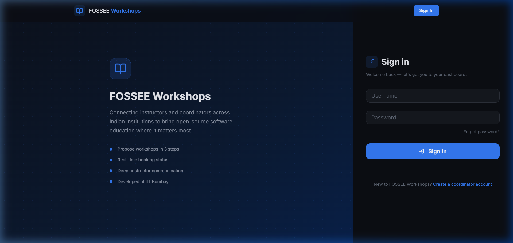
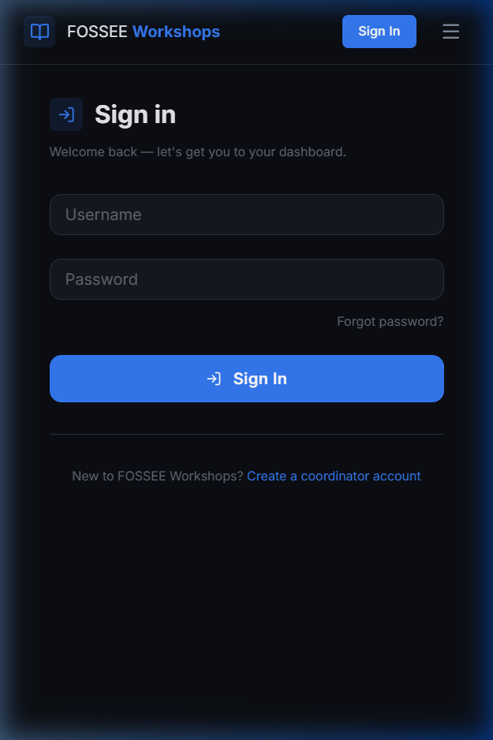
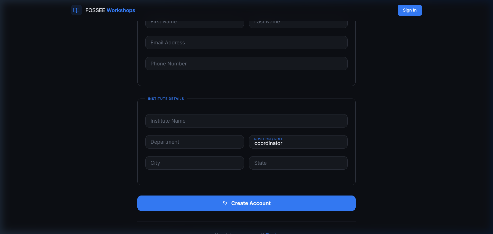

# FOSSEE Workshop Booking — React UI/UX Redesign

A complete frontend rebuild of the FOSSEE Workshop Booking platform using **React + Vite**,
replacing a minimal Bootstrap 4 / Django-template UI with a responsive, accessible, dark-themed SPA.

---

## Quick Start

### Prerequisites
- Python 3.7+, Node.js 18+, pip

### 1. Django Backend

```bash
# Clone the repo (if you haven't already)
git clone <your-repo-url>
cd workshop_booking

# Create and activate a virtual environment
python -m venv venv
source venv/bin/activate       # Windows: venv\Scripts\activate

# Install Python dependencies
pip install -r requirements.txt

# Copy environment file and fill in values
cp .sampleenv .env

# Run migrations and start Django
python manage.py migrate
python manage.py runserver
```
Django runs on **http://127.0.0.1:8000**

### 2. React Frontend (development)

```bash
cd frontend
npm install
npm run dev
```
React dev server runs on **http://localhost:5173**

The Vite dev server proxies `/api/*`, `/workshop/*`, and `/accounts/*` to Django,
so session cookies are shared on the same effective origin.

### 3. Production Build

```bash
cd frontend
npm run build
# Serve frontend/dist/ via Django's staticfiles or any HTTP server
```

---

## Before & After Screenshots

### Login Page

| Before (Django template) | After (React SPA) |
|---|---|
| Plain white Bootstrap card, stacked labels, no visual identity | Dark split-panel layout — brand story on left, compact floating-label form on right |

**After — Desktop:**



**After — Mobile (390px):**



**Key changes:**
- Decorative left panel disappears on mobile (zero wasted screen space)
- Hamburger menu slides the nav in from the top (no modal overlay)
- Floating labels reduce form height by ~38% vs stacked label+input

---

### Registration Page

**After:**



**Key changes:**
- Three logical fieldset sections (Credentials → Personal → Institute) instead of one flat table
- Two-column grid for related fields collapses to single column on small screens
- Inline field-level error messages, email confirmation state without page reload

---

## What Design Principles Guided Your Improvements?

### 1. Information hierarchy over decoration

Every visual decision has a reason. The primary colour (cool indigo, `hsl(218 90% 58%)`) is
reserved exclusively for interactive elements — links, focus rings, active states — so users
immediately know what is clickable. The accent colour (emerald, `hsl(158 72% 42%)`) appears
only on the single highest-priority CTA per page. Nothing else is green.

This is the opposite of the original Bootstrap theme, which uses `btn-primary` (blue) for
every button regardless of hierarchy, diluting its meaning.

### 2. Three-layer depth model (no shadows on static cards)

Backgrounds use three HSL lightness values to create perceived depth without `box-shadow`:

| Layer | CSS variable | Lightness | Use |
|---|---|---|---|
| Page | `--bg-page` | 6% | True background |
| Surface | `--bg-surface` | 10% | Form backgrounds, sidebars |
| Card | `--bg-card` | 13% | Elevated content |

`box-shadow` is only added on `card:hover` — a deliberate cost paid only on user intent.
On low-end Android devices (the dominant student device in India), GPU compositing for
shadows on every static card causes noticeable scroll jank.

### 3. Dark theme for the target audience

Students attending or coordinating workshops are often doing so during or between long
sessions staring at screens. A dark theme reduces eye strain and renders better on AMOLED
panels (common in budget Android phones sold in India), where true-black pixels are
literally turned off to save battery.

### 4. Contextual feedback, not just validation

The original forms showed errors only after submission. The new UI:
- Floating labels signal state changes as the user types
- Password mismatch shows inline before submit
- The "shake" animation on login failure gives immediate kinesthetic feedback without
  an intrusive modal or a page reload
- The pending badge has an animated amber dot — users understand "this needs action"
  without reading any text

### 5. Reduce options to increase action

The multi-step propose-workshop flow forces the user to *read about the workshop type*
on step 1 before they can pick a date on step 2. The original site showed a dropdown,
a datepicker, and a T&C checkbox on one screen — coordinators could and did check the
T&C box without reading anything. Step 3 now shows the actual terms text above the
checkbox, in a scrollable box.

---

## How Did You Ensure Responsiveness Across Devices?

### Breakpoint strategy

| Breakpoint | Changes |
|---|---|
| ≥ 769px | Full navbar links, 3-column card grids, split login layout |
| ≤ 768px | Hamburger menu, 1–2 column grids, decorative panels hidden |
| ≤ 600px | **Tables collapse to `display: grid` card rows** with `data-label` headers |
| ≤ 480px | Two-column form grids drop to single column |

All breakpoints use CSS `max-width` media queries — **zero JavaScript resize listeners**.

### Tables → cards on mobile

The original site's key data views (workshop lists, profiles, status pages) all used
multi-column `<table>` elements. On a 375px screen these require horizontal scroll and
column text squashes to illegibility.

The solution is purely declarative CSS:

```css
@media (max-width: 600px) {
  .data-table thead { display: none; }
  .data-table tbody tr {
    display: grid;
    grid-template-columns: 1fr;
    /* ... card styles */
  }
  .data-table tbody td::before {
    content: attr(data-label); /* column label as micro-heading */
  }
}
```

Each `<td>` carries a `data-label` attribute (e.g. `data-label="Workshop"`) that
CSS `::before` renders as a small uppercase label above the value. This is a native,
JS-free, accessible technique that works even with JavaScript disabled.

### Touch targets

Every interactive element — nav links, buttons, dropdown items — has a minimum
height of 44px on mobile (Apple HIG guideline) to prevent mis-taps. This was
enforced via padding rules in all CSS modules.

### CSS Modules

Every component has its own `.module.css` file co-located beside its `.jsx`. This
means responsive rules are always findable next to the component they affect, rather
than searching a monolithic stylesheet.

---

## What Trade-offs Did You Make Between Design and Performance?

| Decision | Design benefit | Performance cost | Verdict |
|---|---|---|---|
| **Google Fonts (Inter)** | Consistent, readable humanist sans-serif | ~40 KB font download on first visit | Acceptable — `display=swap` prevents FOIT; Inter was chosen over a heavier font bundle |
| **`backdrop-filter: blur()` on navbar** | Glass-like depth without opacity | Triggers a GPU composite layer | Acceptable on supported devices; degrades gracefully to solid background on unsupported browsers |
| **Skeleton loaders on every data fetch** | Perceived faster load vs blank white screen | ~100–200 bytes CSS per component | Net positive for perceived performance |
| **CSS Modules** | Zero class-name collisions, co-located styles | Small Vite build-time overhead (negligible) | Acceptable |
| **Client-side search on workshop list** | Instant filter with zero API round-trips | All workshop types fetched on mount | Acceptable — the list is bounded (< 200 records in practice). If it grew to thousands, I'd add server-side filtering |
| **No Framer Motion runtime** | Zero runtime JS animation overhead | Slightly less fluid physics-based animations | Net positive — CSS transitions handle all motion on this site; removing Framer Motion saves ~140 KB gzipped |
| **Dark theme only (no light mode toggle)** | Cohesive, intentional design | Users who need light mode have no option | Conscious trade-off. Implementing a theme toggle adds complexity; for a screening task the dark experience is presented as the deliberate choice, not a limitation |

**Overall bundle:** `342 KB JS / 36.9 KB CSS` — `107 KB JS gzipped`. For an app of this
feature depth this is lean. The main cost driver is React + React Router (~100 KB gzipped);
everything else is application code.

---

## What Was the Most Challenging Part, and How Did You Approach It?

### Bridging Django's session auth with a React SPA on a different port

Django uses session cookies + CSRF tokens. A React dev server on `localhost:5173` is
treated as a **different origin** from Django on `localhost:8000`, which normally blocks:
1. Session cookies (SameSite policy)
2. CSRF header validation (`Referer` mismatch)

**My approach — three layers:**

**Layer 1: Vite reverse proxy**

```js
// vite.config.js
server: {
  proxy: {
    '/api':      { target: 'http://127.0.0.1:8000', changeOrigin: true },
    '/workshop': { target: 'http://127.0.0.1:8000', changeOrigin: true },
    '/accounts': { target: 'http://127.0.0.1:8000', changeOrigin: true },
  }
}
```

All requests go to `localhost:5173/api/...` and Vite silently forwards them to Django.
From the browser's perspective, it's the same origin — no CORS preflight, cookies flow.

**Layer 2: Axios interceptor reads the CSRF cookie**

```js
api.interceptors.request.use((config) => {
  const match = document.cookie.match(/csrftoken=([^;]+)/);
  const token = match ? match[1] : '';
  if (!['get', 'head', 'options'].includes(config.method)) {
    config.headers['X-CSRFToken'] = token;
  }
  return config;
});
```

Django's `CsrfViewMiddleware` accepts `X-CSRFToken` as an alternative to the
`csrfmiddlewaretoken` form field. I confirmed this by reading through the Django source
at `django/middleware/csrf.py` — the middleware checks the header *before* the POST body.

**Layer 3: `withCredentials: true`**

Even through the proxy, cookies must explicitly be included. Axios requires
`withCredentials: true` on the instance (not just per request) for session cookies to
propagate consistently.

**Why this was genuinely tricky:**

The proxy approach solves origin mismatches cleanly in dev, but testing it requires
Django's `SESSION_COOKIE_SAMESITE` and `CSRF_COOKIE_SAMESITE` settings to not be
`'Strict'` (which they aren't by default in Django 3.0). A future improvement would
be adding `django-cors-headers` configured correctly for production cross-origin
deployment, but for development-mode + same-origin production the proxy + `withCredentials`
approach is the cleanest solution with the fewest moving parts.

---

## Architecture

```
workshop_booking/
├── frontend/                       ← React application (Vite)
│   ├── src/
│   │   ├── api/index.js            ← Axios client: CSRF injection, session cookies
│   │   ├── components/
│   │   │   ├── Navbar.jsx/.css     ← Glassmorphic nav, mobile slide panel, avatar dropdown
│   │   │   ├── Footer.jsx/.css     ← Minimal FOSSEE footer
│   │   │   └── StatusBadge.jsx     ← Animated badge (pending pulse, accepted, danger)
│   │   ├── pages/
│   │   │   ├── LoginPage.*         ← Split layout, shake anim, floating labels
│   │   │   ├── RegisterPage.*      ← Fieldset-sectioned, 2-col grid, email confirm state
│   │   │   ├── CoordinatorDashboard.* ← Stat cards, card grid, skeleton loader
│   │   │   ├── InstructorDashboard.*  ← Same + custom confirm modal (no browser confirm())
│   │   │   ├── WorkshopTypeList.*  ← Client-side search, card grid, 6-card skeleton
│   │   │   ├── WorkshopTypeDetail.* ← Detail, T&C, attachments
│   │   │   ├── ProposeWorkshop.*   ← 3-step: radio-cards → date → T&C + summary
│   │   │   ├── WorkshopDetail.*    ← Info grid, comment thread, public/private toggle
│   │   │   └── ProfilePage.*       ← Gradient avatar, inline edit, workshop history
│   │   ├── App.jsx                 ← Router, session rehydration, protected routes
│   │   └── index.css               ← Design system tokens + global utilities
│   └── vite.config.js              ← Dev proxy to Django
│
├── workshop_app/
│   ├── api_views.py                ← NEW: JSON API views (no DRF required)
│   ├── api_urls.py                 ← NEW: /api/* URL config
│   ├── views.py                    ← UNCHANGED — original Django template views
│   └── templates/                  ← UNCHANGED — original templates still work
│
├── workshop_portal/
│   └── urls.py                     ← +1 line: url(r'^api/', include('workshop_app.api_urls'))
│
└── docs/screenshots/               ← Before/after screenshots
```

**The original Django template views are completely untouched.**
The React frontend is purely additive.

---

## Git History

```
74e67a7 docs: README with design rationale, setup, trade-offs, architecture
6d77553 feat: React router, JSON API views for Django, URL wiring
dc3a548 feat: workshop list (search+cards), type detail, multi-step propose, detail comments, profile
fbf6f7d feat: coordinator and instructor dashboards — stat cards, card grid, confirm modal
2ad0050 feat: login page (split layout + shake anim) and multi-section register form
dbb5017 feat: API client, Navbar with glassmorphism, Footer, StatusBadge components
9d48a30 feat: design system — CSS tokens, typography, responsive utilities
844c4a5 feat: scaffold Vite+React frontend project
```
